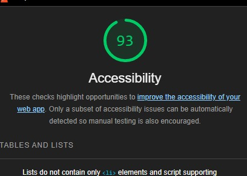

# LAB - 2

## aboutMe

-This site is about me, it prompts the user for a name and will ask 5 yes/no question about me. it now has mini game, user gets prompted a question and will have to answer within a certain amount of guesses.

### Author: Anthony Sinitsa

### Links and Resources

<!-- - https://codefellows.github.io/code-201-guide/curriculum/class-02/project-setup -->

### Lighthouse Accessibility Report Score

### Reflections and Comments

- My index file is very large and can definitely be condensed a lot, this is something I will do later on.
